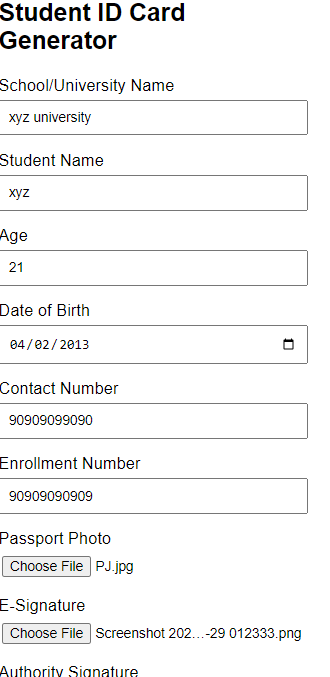
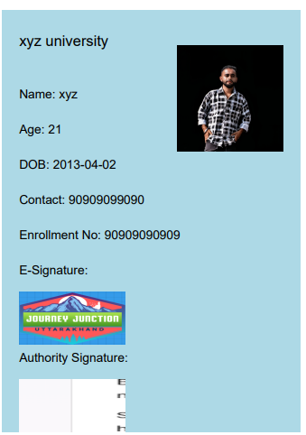

# Student ID Card Generator
This project is a web-based tool that generates a student ID card in PDF format using JavaScript and the jsPDF library. Users can enter their details, upload a passport photo, and optionally include their e-signature and an authority's signature. The generated ID card can be downloaded as a PDF.

## Features
Generate a student ID card with essential details such as:
School/University Name
Student Name
Age, Date of Birth, and Contact Number
Enrollment Number
Passport Photo
E-Signature (optional)
Authority Signature (optional)
Download the ID card as a PDF file.
Easy to use form layout for entering data.
Demo
Here's a preview of the generated ID card format (replace this with your actual screenshot):

#view online 
https://programerpj69.github.io/Pj_Studentid_cardGen_web/

### How to Use
- Clone this repository or download the files.

### git clone 
https://github.com/your-repository/student-id-card-generator.git

- Open the index.html file in your favorite web browser.

### Fill out the form with your details:

School/University Name: Enter the name of the institution.
Student Name: Enter the full name of the student.
Age: Enter the age of the student.
Date of Birth: Select the student's date of birth.
Contact Number: Provide a valid contact number.
Enrollment Number: Enter the enrollment number of the student.
Passport Photo: Upload a passport-size image of the student.
E-Signature: (Optional) Upload the student's e-signature.
Authority Signature: (Optional) Upload the signature of an authority figure.
Click the Generate ID Card button.

#### A PDF file will be generated and downloaded with the details provided.

- Screenshots
- Form for Input
-  Generated ID Card Preview

# Project Structure
index.html: The main HTML file that contains the form and JavaScript to generate the ID card.
- <style>: Contains the styling for the form (if any custom styling is needed)....

- <Stript>: JavaScript file that handles form submission and PDF generation using jsPDF.
jspdf.min.js: External library to generate PDF documents.
Libraries Used
jsPDF: A popular library for generating PDF files in the browser.
License
This project is licensed under the MIT License - see the LICENSE file for details.
# View   output
 

